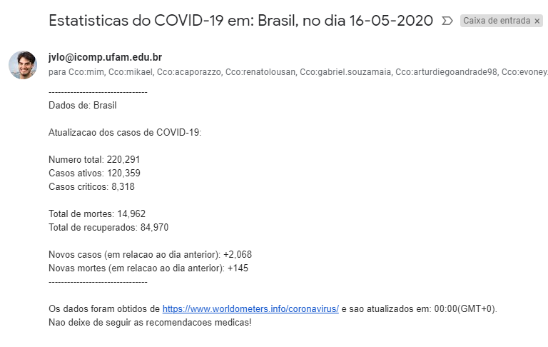
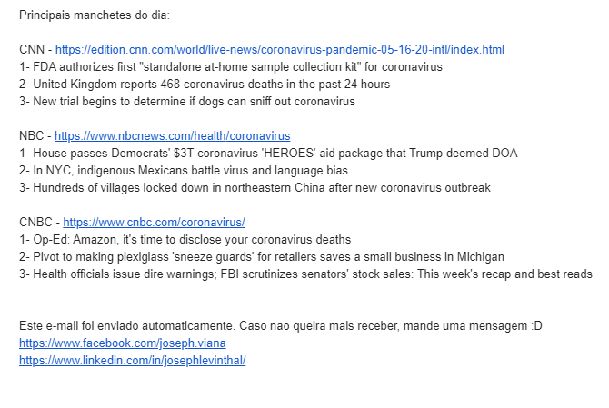

# CoronaMail

> Webscraping some Covid-19 data with python.

Python program for web scraping information related to coronavirus and main news from websites, such as CNN, NBC and CNBC. As well as to send an e-mail with these informations every day.



## Disclaimer

This was created almost exclusively for learning purposes, I know the code is a huge mess, but keep that in mind.

## Installation

You will need to install and import some Python libs:

```sh
* time
* datetime
* webdriver
* schedule
* bs4
* requests
* pandas
* smtplib
* email.utils
* datetime
* email.mime.multipart
* email.mime.text
* email.mime.image
```

You will also need a browser driver for connection and automation, I'am using ChromeDriver:

<https://chromedriver.chromium.org/downloads>

## Release history 

* 2.0.2
  * FIX: Update scraping structure to collect correct data
* 2.0.1
  * CHANGE: Create pandas dataframe for headlines manipulation
* 2.0.0
  * CHANGE: Add headlines from famous news websites
* 1.0.0
  * The first functional release

## Meta

Joseph Levinthal – jvlo@icomp.ufam.edu.br

[https://github.com/JosephLevinthal](https://github.com/JosephLevinthal)

